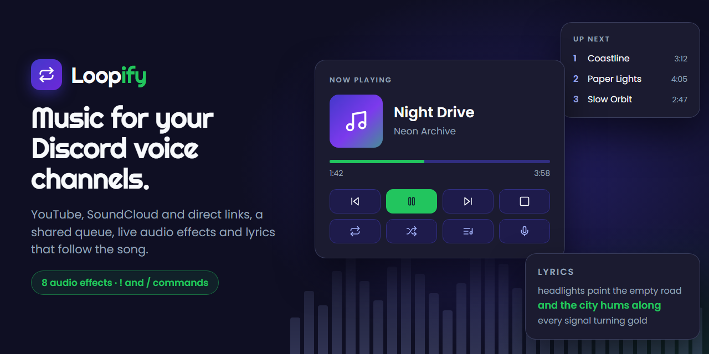
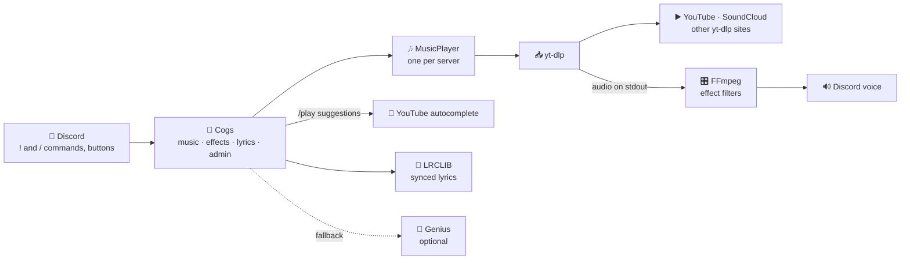

<div align="center">



[](https://github.com/Isma-L154/LoopifyBot/actions/workflows/tests.yml)


[](LICENSE)

**A self-hostable Discord music bot written in Python.**

Plays YouTube, SoundCloud and direct links into a voice channel, with a shared
queue, FFmpeg audio effects and lyrics that follow the song line by line.

[Invite the bot](https://discord.com/oauth2/authorize?client_id=1411151372446863491&permissions=36784128&integration_type=0&scope=bot+applications.commands) · [Report a bug](https://github.com/Isma-L154/LoopifyBot/issues) · [Run it locally](#running-locally)

</div>

---

## What it does

- **Plays from YouTube by name or link**, including whole playlists, so
  nobody has to hunt for a URL.
- **Falls back to SoundCloud and other sites**: prefix a search with `sc:`, or
  paste any link yt-dlp supports. When YouTube blocks a track, the bot says so,
  suggests SoundCloud and moves on to the next song.
- **Keeps a shared queue per server** with shuffle, move, remove, previous,
  track or queue loop, and an optional autoplay.
- **Applies eight live audio effects** (bass boost, nightcore, vaporwave, 8D,
  echo, karaoke…) from the current position, without restarting the song.
- **Follows the lyrics in one message** that updates line by line with the
  song, and stays in sync under the speed-changing effects
  ([design notes](docs/design/2026-09-12-synced-lyrics.md)).
- **Works with `!` commands, `/` commands and buttons**: every Now Playing
  message carries playback controls, and `/play` suggests searches as you type
  ([design notes](docs/design/2026-09-27-interactive-controls.md)).
- **Leaves on its own** after five minutes with nothing to play.

## Commands

Every command below also works as a slash command (`/play`, `/skip`,
`/effect`…). Aliases (`!p`, `!q`, `!bass`…) are `!`-only; under `/` the effects
are picked from `/effect`.

Each **Now Playing** message carries buttons for anyone in the bot's voice
channel: ⏮ ⏯ ⏭ ⏹ on the first row, 🔁 (cycle loop) 🔀 (shuffle) 📜 (queue,
shown only to you) 🎤 (live lyrics) on the second. When the next song starts,
the previous message's buttons are disabled.

### ▶️ Playback

| Command | Description |
|---|---|
| `!play <song/url>` | Play from YouTube (search, video, playlist), SoundCloud or a link. Prefix a search with `sc:`/`soundcloud:` or `yt:`/`youtube:` to pick the site |
| `!pause` | Pause the current track |
| `!resume` | Resume playback |
| `!skip` | Skip to the next track |
| `!previous` | Go back to the previous track |
| `!stop` | Stop playback and disconnect the bot |
| `!nowplaying` | Show the currently playing track |

### 📋 Queue

| Command | Description |
|---|---|
| `!queue [page]` | Display the current queue |
| `!shuffle` | Shuffle the queue |
| `!remove <#>` | Remove a track by its position |
| `!move <from> <to>` | Move a track to a different position |
| `!clear` | Clear the queue; the current track keeps playing |
| `!loop [track\|queue\|off]` | Set the loop mode (default: `track`) |
| `!autoplay` | When the queue runs out, queue a track from a YouTube search for `"<uploader> mix"` |

### 🔊 Audio

| Command | Description |
|---|---|
| `!volume <0-100>` | Set the playback volume |
| `!bass` | Apply a light bass boost |
| `!bassboost` | Apply a heavy bass boost |
| `!nightcore` | Speed up and raise pitch (1.25x) |
| `!vaporwave` | Slow down and lower pitch (0.8x) |
| `!treble` | Boost treble frequencies |
| `!echo` | Add an echo effect |
| `!8d` | Apply 8D audio (use headphones!) |
| `!karaoke` | Remove center vocals |
| `!reset` | Remove all audio effects |
| `!effect [name]` | Show the active effect, or apply one by name |
| `!effects` | List all available effects |

Effect changes are limited to one every three seconds per server, because each
one restarts the FFmpeg process.

### 🎤 Extras

| Command | Description |
|---|---|
| `!lyrics` | Follow the current song's lyrics live, in one self-updating message |
| `!lyrics <title>` | Look up lyrics by song title |
| `!lyrics <title> - <artist>` | Look up lyrics by title and artist (the reverse order works too) |
| `!help` | Show the full command list |

## How it works



Discord commands land in the cogs (`cogs/`), which drive one `MusicPlayer` per
server (`utils/player.py`). The cogs handle Discord and the player owns the
queue. Calls to outside services live in `services/`.

yt-dlp downloads the audio and writes it to stdout, and FFmpeg reads that pipe.
Handing FFmpeg the YouTube URL directly gets a 403, because those URLs only
work for the client that requested them. A few seconds of audio are buffered
ahead (`BufferedAudioSource`), so a stall in the download never delays a frame.
yt-dlp's blocking calls run in a thread executor, never on the event loop.

Lyrics come from LRCLIB first, because it is the only source with line
timings, and from Genius only when LRCLIB has nothing. YouTube's player
changes often, so `yt-dlp` is the one dependency left unpinned; on a server a
daily timer keeps it current (see [Deployment](#deployment)).

**Stack:** Python 3.14 · discord.py 2.7 · yt-dlp · FFmpeg · aiohttp · lyricsgenius · systemd

## Running locally

### Requirements

- Python 3.14
- FFmpeg on your `PATH`
- A Discord bot token with the **Message Content** intent enabled, the only
  privileged intent the bot asks for

### Setup

```bash
python -m venv .venv
.venv/bin/pip install -r requirements.txt      # Windows: .venv\Scripts\pip
cp .env.example .env                            # then fill in DISCORD_TOKEN
python main.py                                  # look for "Logged in as ..."
```

Then send `!sync` from the Discord account that owns the bot application. That
registers the `/` commands; until it runs, only the `!` commands exist. Send it
again whenever a command is added, removed or changed.

### Environment variables

| Variable | Description |
|---|---|
| `DISCORD_TOKEN` | **Required.** Bot token from the [Discord developer portal](https://discord.com/developers/applications) → your application → Bot. The bot exits at startup without it. |
| `COMMAND_PREFIX` | Prefix for text commands. Default `!`. |
| `GENIUS_TOKEN` | Optional. Client access token from [genius.com/api-clients](https://genius.com/api-clients). Only adds a lyrics fallback for songs LRCLIB does not have; LRCLIB needs no key. |
| `COOKIES_PATH` | Optional. Netscape-format `cookies.txt`, relative to the project root or absolute. Needed for YouTube from a datacenter IP; see [deploy/README.md](deploy/README.md#cookies-supported-no-longer-needed). |
| `LOG_LEVEL` | `DEBUG`, `INFO`, `WARNING` or `ERROR`. Default `INFO`. |

`.env` and `cookies.txt` are git-ignored and must never be committed. Write
values literally with no trailing comments; see the notes at the top of
[.env.example](.env.example).

### Tests and checks

```bash
.venv/bin/pip install -r requirements-dev.txt   # Windows: .venv\Scripts\pip
pytest            # the test suite
ruff check .      # correctness lint (ruff.toml)
mypy              # every function must be typed (mypy.ini)
```

The suite needs **no credentials, no network and no `.env`**: it mocks the
Discord gateway and never calls yt-dlp. It covers:

- the queue, the player's state machine (loop modes, skip, replay, autoplay,
  idle timeout), seeking and prefetch;
- the read-ahead buffer and stream teardown;
- every command's edge cases and the voice-channel guards;
- the Now Playing buttons and the `/play` suggestions;
- synced lyrics, the line-following message and the Genius fallback;
- startup and shutdown, including that a login survives a DNS outage and that
  the process stops within the time systemd allows.

A few tests render audio through **real FFmpeg** to check the speed of the
pitch filters, because a wrong filter string looks fine and only shows up as
the wrong playback speed. They skip if FFmpeg is not installed.

CI ([tests.yml](.github/workflows/tests.yml)) runs the lint, the type check and
the tests on Python 3.14, which is both what the server runs and the newest
release, on every push to `main` and every pull request.

### Regenerating the banner

The banner is drawn in HTML from [docs/brand/banner.html](docs/brand/banner.html):

```bash
npx playwright install chromium   # once per machine
npx -y playwright@1.63.0 screenshot --viewport-size "1280,640" "file:///<absolute path>/docs/brand/banner.html" docs/brand/banner.png
```

## Deployment

The hosted instance runs on a **self-hosted Ubuntu machine on a residential
connection**, not on a cloud VM. The reason is YouTube, not cost: from a
datacenter IP the bot needed a cookies file that expired every few weeks, and
from a residential IP the same requests work without one. Deploying to AWS EC2
is still supported and documented, with that caveat.

[deploy/README.md](deploy/README.md) has the full walkthrough:

- `deploy/setup.sh` installs FFmpeg, Python and Deno, builds the venv and
  registers the `loopify-bot` systemd service, which restarts on failure and
  starts on boot;
- `deploy/update.sh` pulls, reinstalls dependencies only when
  `requirements.txt` changed, reinstalls the units and checks the service came
  back up;
- a daily `loopify-ytdlp-update` timer keeps `yt-dlp` current and restarts the
  bot only when the version changed;
- `deploy/launch_ec2.sh` launches a `t4g.micro` that accepts SSH only from your
  IP.

The only secret is `.env`, created by hand on the host; nothing is deployed
from CI.

## Security

- **Secrets in the environment:** tokens are read from `.env` only
  ([config.py](config.py)); the bot exits at startup when `DISCORD_TOKEN` is
  missing, `setup.sh` sets `.env` to `chmod 600`, and the log setup never
  prints tokens.
- **No probing of private networks:** `!play` refuses a link unless every
  address its host resolves to is public (`services.media.is_public_url`), so
  a guild member cannot point the bot at your LAN or a cloud metadata
  endpoint. Redirects are followed by yt-dlp and not re-checked, so this
  narrows the exposure rather than closing it.
- **Input validation:** command arguments are typed and range-checked
  (`!volume` accepts 0–100, loop modes and effect names come from fixed lists),
  and search terms are passed to yt-dlp after `--`, so they are never read as
  options.
- **Rate limiting:** effect changes are throttled to one every three seconds
  per server, and `/` commands are only registered through the owner-only
  `!sync`, because Discord rate-limits syncing.
- **Sandboxed service:** the systemd unit runs as an unprivileged user with
  `NoNewPrivileges`, `ProtectSystem=strict`, a read-only home, restricted
  address families, and caps of 768 MB of memory and 256 tasks
  ([install-units.sh](deploy/install-units.sh)).
- **Inbound closed:** the bot only makes outbound connections; the EC2 security
  group opens SSH to a single IP and nothing else.
- **Supply chain:** runtime dependencies are pinned except `yt-dlp` (see
  [requirements.txt](requirements.txt)), Dependabot proposes weekly updates for
  pip and GitHub Actions, and CI runs with `contents: read` permissions.

CORS, Row Level Security and a Content Security Policy do not apply: the bot
serves no HTTP and keeps no database.

## License

[MIT](LICENSE) © 2025 Ismael Leon
